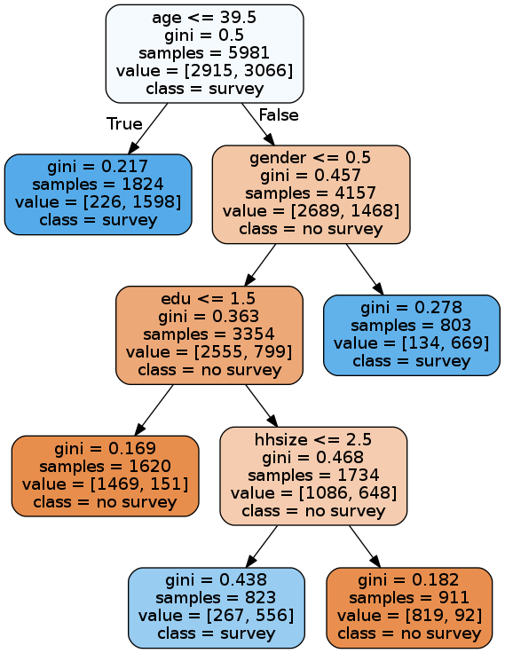

Lucas Gorski

Data Mining Project

**Parks and Rec Analysis**

It is with great pleasure that I was able to help Leslie and Company with the analyzing the Pawnee Parks and Recreation survey to plan parks more in tune with the resident&#39;s needs, as well as analyzing their population data to understand how we can better motivate those stubborn Pawneean&#39;s to actually respond to the survey.

**Survey Analysis: Consolidation of Parks**

My first step was to analyze the survey data. I used the KMeans algorithm in order to understand which subsets of the population find each park attraction important. I chose a cluster number of 5, because it seemed to best separate out the clusters. Here is the scatterplot generated from this exercise:

Now, we can see that there is some separation between clusters. For example, Pawneeans in the purple (4) cluster clearly have a different set of priorities when it comes to parks than do those in the red (3) or green (2) clusters. However, those in the red cluster seem to share a lot of similarities with those in the green cluster, and those in the orange (1) cluster share a lot of similarities with those in the purple and blue (0) clusters.

Although Pawneeans are drawn to bright colors, this graphic doesn&#39;t offer much more insight as to what the members of a particular cluster value. In order to learn more, for each cluster I summed their survey results as seen below:

Next, I assigned each cluster to their highest priority park attractions. Of course, another factor we should consider is the importance of each cluster. For example, cluster 0 clearly has the most responses with n=1961 responses, versus the next highest (5) with n=815 responses. Since cluster 0&#39;s residents seem to care more about the parks then the rest of the clusters, and their top 4 responses outnumber any of the other 4 clusters for the specific attractions, I give them priority over the other clusters.

**Resident Analysis**

My next step was determining how we could best motivate more Pawneeans to respond to the parks survey. First I had to replace some missing values, so I replaced them with the mean value of their respective column. Next, I separated the data into training data and test data, using 70% of the data to train and 30% to test.

In order to glean insight, I used a decision tree model, as seen below:

I will cover the accuracy of this model later, but first some analysis: I used a maximum leaf value of 5, in order to prevent overfitting the training data and to make the tree easier to analyze. As you can see, Pawneeans aged 39.5 years or younger were likely to respond to the survey. Among older Pawneeans, males tend to answer the survey more often than females. Amongst the older female Pawneeans, those with less than a college degree were not likely to answer the survey. Out of those older female Pawneeans with a college degree or higher, those with household sizes less than 3 were more likely to answer the survey than those with larger households.

In addition to using a Decision Tree, I also used Naïve Bayes, Support Vector Machines, and an Artificial Neural Network to test the validity of my decision tree against. I tested these models against eachother using 10 fold cross validation, and achieved the following results:

As you can see, the Decision Tree was only outperformed by the ANN, which is to be expected. Therefore, with an average accuracy of 84.8%, my Decision Tree is a valid classifier.

**Conclusion**

So, my recommendation to increase survey responses boils down to:

- Encourage older Pawneeans to answer the survey, by handing the survey out at bingo halls and other gathering places geared towards older Pawneeans.
- Encourage the less educated, older Female Pawneeans by distributing the survey at female frequented spots, such as hair salons and clothing stores, as well as places who employ working class labor.
- Encourage busy mothers with large households to respond to the survey by distributing them at PTA meetings, or maybe even send Jean-Ralphio door to door in order to make it less of an inconvenience.

I also propose that we consolidate all existing parks in Pawnee into two parks; one for clusters 0, 1, and 4 (blue, orange, and purple), and another park for clusters 2 and 3 (green and red).

The park for clusters 0, 1, and 4 would have the following attractions: woods, courts, a dog area, a track, a picnic area, walking paths, and a nature area. The park for clusters 2 and 3 would have a playground, a pool, and a field.

Of course, Pawnee could also build a park specifically for each cluster, however Pawnee is too poor to afford that. I would recommend that approach to Eagleton. RIP Lil Sebastion!
